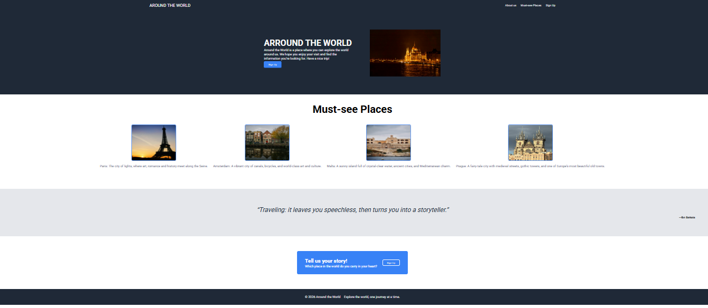

# Around The World

A travel landing page built with HTML and CSS Flexbox.

## 🔗 Live Demo
[View it live](https://miriamromeromon.github.io/land-page-flex/)

## ✨ Features
- Responsive navigation menu with anchor links
- Hero section with image
- Must-see places gallery
- Quote section
- Call to action with sign up button
- Footer

## 🛠️ Built With
- HTML
- CSS (Flexbox)
- Google Fonts (Roboto)

## 🚀 Getting Started
Clone the repo and open `index.html` in your browser — no dependencies needed.